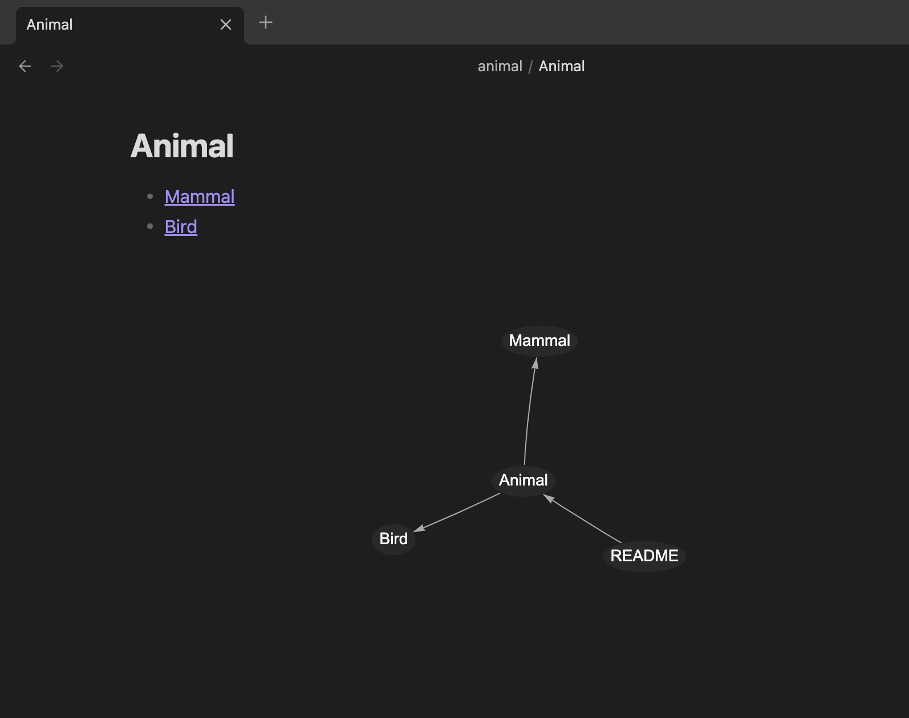

# Inline Local Graph

Displays a custom `local graph` of the current note directly at the bottom of the note content.

## Usage

Simply enable the plugin, and the inline local graph will automatically appear at the bottom of your note.

## Features

### Practical Local Graph Visualization

A custom local graph focused on clarity, displaying links and backlinks without flashy visual effects, making it easy to understand and navigate between notes.

## Dependencies

This plugin uses the [vis-network.js](https://visjs.github.io/vis-network/) library to render interactive network graphs inside your notes.

