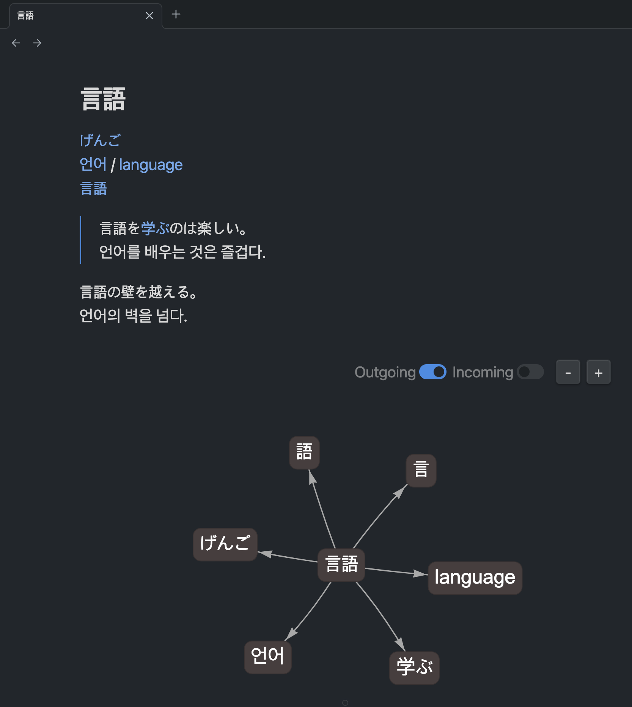

# Inline Local Graph

**English** | [한국어](./README.ko.md) | [日本語](./README.ja.md)

Displays a custom `local graph` of the current note directly at the bottom of the note content.
Utilizes the unused space at the bottom of your notes!

## Why

Obsidian's local graph lives in a side panel — you have to open it, resize it, and look away from
what you are reading. Inline Local Graph puts the same information where your eyes already are:
at the end of the note, in the space that is usually blank.

It is especially handy for notes that are short but heavily interlinked — vocabulary cards,
glossaries, daily notes, MOCs — where the links *are* the content.

### Example: learning foreign words

The screenshot above is a vocabulary card for the Japanese word 言語 (*gengo*, "language").
It links out to its kana reading (げんご), its Korean and English equivalents (언어 / language),
the two kanji it is built from (言, 語), and a verb it often appears with (学ぶ).

The whole word family sits right below the card, so reviewing one word pulls its neighbours back
into view — no side panel, no context switch.

## Features

### Practical local graph visualization

A custom local graph focused on clarity, displaying links and backlinks without flashy visual
effects, making it easy to understand and navigate between notes.

- **Outgoing and incoming links** — toggle each independently from the control bar or settings
- **Node styling** — shape, background color, and font size
- **Label truncation** — with separate limits for alphabet and CJK (Korean/Japanese/Chinese) labels,
  so wide characters do not stretch nodes
- **Node limit** — cap how many nodes are displayed to keep dense notes readable
- **Image links excluded** — embedded images do not clutter the graph
- **Localized UI** — English, Korean, and Japanese

## Installation

### From Obsidian's community plugins

1. Open **Settings → Community plugins** and make sure Restricted mode is off.
2. Click **Browse**, search for **Inline Local Graph**.
3. Click **Install**, then **Enable**.

### Manual installation

1. Download `main.js`, `manifest.json`, and `styles.css` from the
   [latest release](https://github.com/TKOxff/obsidian-inline-local-graph/releases).
2. Copy them into `<your vault>/.obsidian/plugins/inline-local-graph/`.
3. Reload Obsidian and enable the plugin in **Settings → Community plugins**.

## Usage

Simply enable the plugin, and the inline local graph will automatically appear at the bottom of
your note.

A small control bar sits above the graph:

| Control | What it does |
| --- | --- |
| **Outgoing** | Show or hide links going out of the current note |
| **Incoming** | Show or hide backlinks pointing at the current note |
| **+ / −** | Zoom the graph in and out |

Click any node to open that note. Mouse-wheel zooming is intentionally disabled so scrolling
through a note never gets trapped inside the graph.

## Settings

Settings live under **Settings → Community plugins → Inline Local Graph**.

### Graph

| Setting | Description | Default |
| --- | --- | --- |
| Show arrows on edges | Toggle arrow display on graph edges. | On |
| Show graph border | Toggle the border around the graph container. | Off |
| Show outgoing links | Toggle whether to display outgoing links in the graph. | On |
| Show incoming links | Toggle whether to display backlinks in the graph. | On |
| Skip image links | Toggle whether to exclude image files from the graph. | On |
| Initial zoom | Set the initial zoom scale for the inline graph. | 1.0 |
| Max displayed nodes | Maximum number of nodes shown, excluding the active note (which is always shown). Outgoing links are prioritized over backlinks. Range 1–200. | 30 |

### Node style

| Setting | Description | Default |
| --- | --- | --- |
| Node shape | Ellipse, Box, Circle, Dot, or Text only. | Box |
| Node background color | Set the background color of graph nodes. | `#888888` |
| Node font size | Set the font size of node labels. | 14 |
| Truncate labels | Shorten long node labels with an ellipsis (...). | On |
| Max label length (alphabet languages) | Maximum characters before truncation for alphabet-based languages. | 20 |
| Max label length (Korean/Japanese/Chinese) | Maximum characters before truncation for non-alphabet languages. | 10 |

## Dependencies

This plugin uses the [vis-network.js](https://visjs.github.io/vis-network/) library to render
interactive network graphs inside your notes.

## Support

If this plugin is useful to you, you can support its development:

## License

[MIT](./LICENSE) © TKOxff
